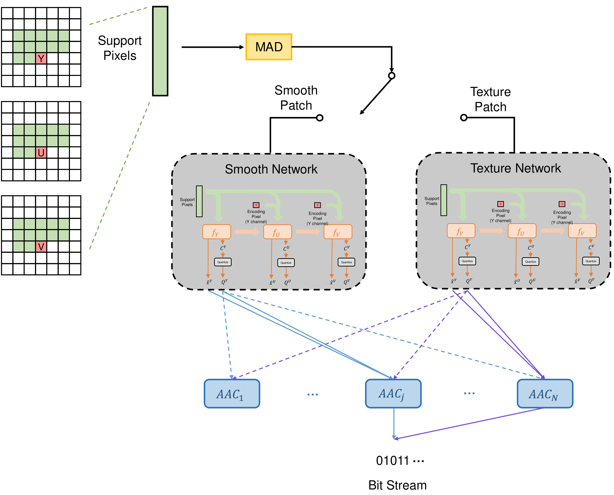

Implementation of "Lossless Color Image Compresion by Joint Prediction of Pixel and Coding Context Using Duplex Neural Networks"

Hochang Rhee, Yeong Il Jang, Seyun Kim, and Nam Ik Cho

## Environments
- Ubuntu 18.04
- [Tensorflow 1.9](http://www.tensorflow.org/)
- CUDA 9.0 & cuDNN 7.6.5
- Python 3.5.5

## Abstract

This paper presents a new lossless color image compression method based on the learning of pixel values and coding contexts through a multiplayer perceptron (MLP). The pixel prediction error and contexts are forwarded to an adaptive arithmetic encoder, like the conventional lossless compression schemes. The neural net-based prediction has long been attempted for the lossless compression, and recently convolutional neural networks (CNNs) are also adopted for the lossy/lossless coding. While the existing MLP-based lossless compression schemes focused only on the accurate pixel prediction, we jointly predict the pixel values and coding contexts. We also propose channel-wise progressive learning, residual learning, and duplex network in this MLPbased framework, which leads to improved coding gain compared to the conventional method. Experiments show that the proposed method performs better or comparable to the recent learningbased and conventional compression methods.

## Related Work
[LCIC (TIP 2013)] Hiearchical Predication and Context Adaptive Coding for Lossless Color Image Compression <a href="https://github.com/jyicu/LCIC">LCIC</a>

[FLIF (ICIP 2016)] Free Lossless Image Format Based on MANIAC Compression <a href="https://github.com/FLIF-hub/FLIF">FLIF</a>

[L3C (CVPR 2019)] Practical Full Resolution Learned Lossless Image Compression <a href="https://github.com/fab-jul/L3C-PyTorch">L3C</a>

[CWPLIC (ICIP 2020)] Channel-wise Progressive Learning for Lossless Image Compression <a href="https://github.com/myideaisgood/CWPLIC">CWPLIC</a>

## Proposed Method

### <u>Overall framework of proposed method</u>

<p align="center"></p>

We first apply a reversible color transform proposed in to the input RGB images to decorrelate the color components. Then, for each encoding pixel, prediction for the pixel value and coding context are simultaneously generated in the raster scan order. Afterward,
to utilize the AAC as our entropy coder, we quantize the obtained real-valued coding contexts into N steps, where the level of the quantized coding context is proportional to the magnitude of the local activity. In AAC, individual entropy coder is employed for each quantized coding context, because the statistics of prediction error differs depending on the local activity. Finally, the prediction error is compressed into a bitstream based on the corresponding quantized coding context through the AAC.

<p align="center"></p>

## Experimental Results

**Results on compression performance**

<p align="center"></p>

Comparison of our method with other engineered and learning based codecs. We measure the performances in bits per pixel (bpp). The difference in percentage to our method is highlighted in green if our method outperforms and in red otherwise.

**Results on CPU time**

<p align="center"></p>

Comparision of computation time (CPU time in seconds). We compared times for 512 x 512 image.

**Ablation Study**

<p align="center"></p>

**Prediction Error**

<p align="center"></p>

**Coding Context**

<p align="center"></p>

**Test Data**

[MCM]   (https://www4.comp.polyu.edu.hk/~cslzhang/CDM_Dataset.htm)

[DIV2K] (https://data.vision.ee.ethz.ch/cvl/DIV2K/)

[Flickr2K] (https://github.com/limbee/NTIRE2017)

## Brief explanation of contents

```
├── python_weights_training : python code for training MLP weights
    ├──> ckpt    : trained models will be saved here
    ├──> board   : tensorboard logs will be saved here
    └──> dataset : train/test data should be saved here
└── c_compression : c++ code for compressing images with MLP weights obtained from python code

```

## Guidelines for Codes

### Training

Configuration should be done in **config.py**.

[Options]
```
python main.py --gpu=[GPU_number] --epoch=[Epochs to train]
```

MLP weights of channel Y,U,V will be saved in **weights_y.txt**, **weights_u.txt**, **weights_v.txt**.

### Test (Compression)

Make sure MLP weights.txt and input images are saved at c_compression/x64/Release.

**Encoding**
```
ICIP_Compression.exe e [source file (ppm)] [compressed file (bin)]
```

**Decoding**
```
ICIP_Compression.exe d [compressed file (bin)] [decoded file (ppm)]
```

## Citation
If you use the work released here for your research, please cite this paper.

```
@inproceedings{rhee2020lcic,
  title={Channel-wise progressive learning for lossless image compression},
  author={Rhee, Hochang and Jang, Yeong Il, and Kim, Seyun and Cho, Nam Ik},
  booktitle={2020 IEEE International Conference on Image Processing (ICIP)},
  year={2020}
}
```
